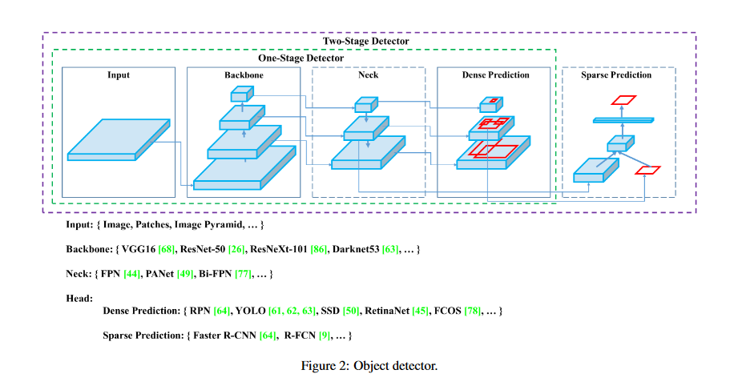

# fruit_detectoion_yolov4
yolov4 object detction training on custom dataset of fruits 

## usecase
The specific study involves developing a robust model for fruit detection. There might be a plethora of sophisticated applications for this. Among them are:

    You work in a warehouse where lakhs of fruits arrive everyday, and physically separating and packaging each fruit box will take a large amount of time. As a result, you may create an automated system that detects fruits and separates them for packing.

    You are the proud owner of a massive orchid. Manual harvesting of the fruits will also need a large staff. You may create a robot or a self-driving vehicle that can recognize and pick fruits from specified trees

## dataset
 gathered images and their labels from Google's Open Images Dataset and using OIDv4 toolkit to generate labels is easy and time efficient. The dataset contains labeled images for over 600 classes! Here we seleted the top availble fruits and downloded them using fifty-one pakage

## yolov4 overview

The original YOLO algorithm was created by Joseph Redmon, who is also the creator of the Darknet custom framework. After 5 years of study and development to the third generation of YOLO (YOLOv3), Joseph Redmon announced his retirement from the area of computer vision and the discontinuation of developing the YOLO algorithm due to concerns that his research will be misused in military applications. He does not, however, challenge the continuance of study by any person or group based on the YOLO algorithm's early principles.

Alexey Bochkovsky, a Russian researcher and engineer who constructed the Darknet framework and three earlier YOLO architectures in C based on Joseph Redmon's theoretical concepts, collaborated with Chien Yao and Hon-Yuan to publish YOLOv4 in April 2020.

## test results:

    
     
    
    

## refrences

1. [YOLOv4: Optimal Speed and Accuracy of Object Detection](https://arxiv.org/pdf/2004.10934.pdf)

2. [google api dataset](https://storage.googleapis.com/openimages/web/index.html)

3. [roboflow article and tips on yolov4 custom training](https://blog.roboflow.com/training-yolov4-on-a-custom-dataset/)

4. [youtube short video on yolov4 changes compare to previous aritecture](https://youtu.be/E-JGH7bLI_8?si=7L---CZHiee-Ugqs)